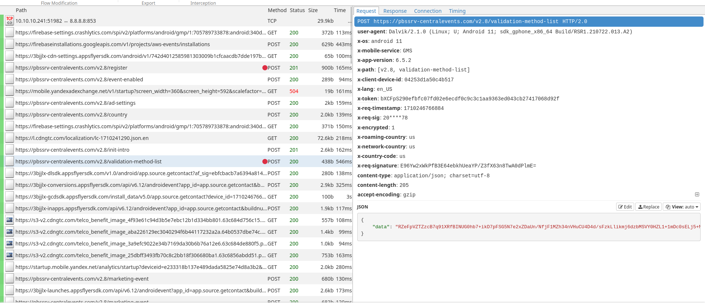
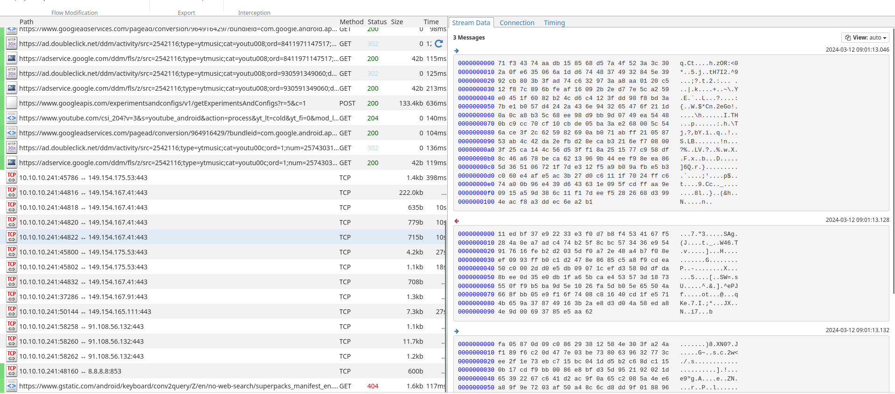

# Данные о личных коммуникациях

Провести анализ распространения данных о коммуникации личного характера


## Описание стенда для эксперимента

В ходе выполнения работы необходимо выполнить перехват 
интернет трафика приложений, разработанных для ОС Android.

### Эмулятор

Для проведения эксперимента используется эмулятор из состава Android Studio:
| Разрядность образа  | Версия Android  | Уровень API | Google APIs | Google Play
|---|---|---|---|---|
| x86_64  | 11 | 30 |+|-


Такой выбор эмулятора и его конфигурации обусловлен несколькими факторами:
- Возможность запуска большинства актуальных версий рассматриваемых приложений, в том числе собранных с поддержкой только `armebai-v7`;
- Возможность добавления сертификатов, доверенных системой;
- Возможность использовать инструменты эмулятора Android Studio (_например,
для симуляции звонков_).

Для анализа трафика приложений реализована атака MITM с подменой сертификатов SSL/TLS при общении приложения с сервером.

### Сетевая настройка

Эмулятор позволяет выполнить настройку `TAP` (_2 уровень OSI_) интерфейса, по которому выполняется передача фреймов.
С помощью `virt-manager` создан `bridge` (_Layer 2 switch_) и виртуальная машина, выполняющая роль шлюза по-умолчанию для эмулятора.
На шлюзе настроен `PAT` и пересылка пакетов через удалённый прокси-сервер, расположение которого позволяет получить доступ к приложениям, работа которых ограничена на территории РФ.

Такая настройка позволяет выполнять прослушивание трафика, проходящего через `bridge` с хост-системы.

Выбраны адреса:
- шлюз (proxy): 10.10.10.10/32
- эмулятор: 10.10.10.128/25


### MITM Proxy

Для выполнения атаки выбран инструмент MITM Proxy. Выбор пал на данный инструмент после череды неуданых реализаций атаки посредством альтернативных популярных решений. _Основным их минусом является неочевидность настройки маршутизации пакетов._

Для того, чтобы большниство рассматриваемых приложений доверяло сертификату, который mitmproxy предоставляет вместо оригинального необходимо выполнить [его загрузку](https://docs.mitmproxy.org/stable/howto-install-system-trusted-ca-android/) на эмулятор. Сертификат генерируется после первого запуска утилиты, а после установки в эмулятор выглядит [следующим образов](shots/mitm_cert.png).

После предварительного анализа трафика приложений был установлен список портов, которые шлюз должен перенаправить на обработку прокси: `80,443,853,9000,9443`.
```console
user@proxy:~$ iptables -t nat -A PREROUTING -s 10.10.10.128/25 -p tcp -m multiport --dports 80,443,853,9000,9443 -j REDIRECT --to-port 8080
```

Запуск mitmproxy с web-интерфейсом и журналированием SSL/TLS ключей выполняется командой:
```console
user@proxy:~$ SSLKEYLOGFILE="sslkeylog" \
mitmweb -m transparent --no-web-open-browser --web-host=10.10.10.10
```

В такой конфигурации прокси-сервер является незаметным для приложений эмулятора. 

_Пример работы прокси:_


### Пример запуска эмулятора

Для прокси создана _Isolated_ сеть (10.10.10.0/24) и bridge-адаптер `virbr1`, к которому виртуальная машина подключена TAP-интерфейсом `vnet1` (10.10.10.10/32).

Для эмулятора создаётся новый TAP-интерфейс `tap0`, который добавляется в bridge `virbr1`:

```console
user@proxy:~$ ip tuntap add dev tap0 mode tap user `whoami`
user@proxy:~$ ip link set dev tap0 up
user@proxy:~$ brctl addif virbr1 tap0
```

Запуск эмулятора выполняется командой:
```console
user@host:~$ emulator -avd ${EMUL_NAME} -writable-system -net-tap tap0
```

В эмуляторе необходимо выключить _мобильный интернет_ и настроить `AndroidWifi` адресом из подсети эмуляторов, а также установить шлюз по-умолчанию: 10.10.10.10 (proxy).


_Пример прослушанного трафика до импорта ключей, сгенерированных прокси:_


_Пример прослушанного трафика после импорта ключей:_


### Подготовка эмулятора

Для проведения эксперимента в телефонную книжку эмулятора добавлены  контакты. Несколько контактов получены в результате синхронизации с Google-аккаунтом.

_При этом указаны номера для разных `label` и электронная почта:_


_Также добавлено несколько звонков и SMS-сообщений:_

 


## Задача 1 - Перечень данных, используемый при импорте данных телефонной книги в приложениях


### Описание приложений

APK-файлы рассматриваемых приложений взяты с портала Apkpure, если не указано иное.

|Название|Пакет|Версия|SSL-pin|
|---|---|---|---|
|Getcontact|app.source.getcontact|6.5.2|-|
|Me - определитель номера|com.nfo.me.android|7.4.18|-|
|VK|com.vkontakte.android|8.69|-|
|Facebook|com.facebook.katana|417.0.0.33.65|+|
|Instagram|com.instagram.android|275.0.0.27.98|+|
|Одноклассники|ru.ok.android|24.3.4|-|
|Telegram|org.telegram.messenger|10.9.1|*|
|LinkedIn|com.linkedin.android|4.1.914|-|

_Примечание: актуальные версии приложения `LinkedIn` не поддерживают импорт контактов._

### Результаты

|Название|Результат|Способ|
|---|---|---|
|Getcontact|*|SSL-proxy|
|Me - определитель номера|+|SSL-proxy|
|VK|+|SSL-proxy|
|Facebook|+|SSL-unpin + SSL-proxy + QUIC-lock|
|Instagram|+|SSL-unpin + SSL-proxy + QUIC-lock|
|Одноклассники|+|SSL-proxy|
|Telegram|-||
|LinkedIn|+|SSL-proxy|

### Getcontact


|Разрешение|Требуется|По запросу|
|---|---|---|
|Контакты|+||
|Совершать звонки|+||
|Журнал вызовов|+||
|Приложение для звонков по-умолчанию||+|
|Anti-spam приложение по-умолчанию||+|


Удалось перехватить HTTP траффик, однако приложение использует внетреннюю схему шифрования сообщений, получить открытый текст из которых не удалось.

_Регистрация приложения до подключения внутреннего шифрования:_


_Сообщение после подключения шифрования:_



### Me - определитель номера


|Разрешение|Требуется|По запросу|
|---|---|---|
|Контакты|+||
|Журнал вызовов|+||
|Anti-spam приложение по-умолчанию||+|


__Синхронизация контактов__

[Скриншот](shots/apks/me_contacts.png) - https://app.mobile.me.app/main/contacts/sync/

`POST-запрос с JSON:`
```json
{
    "add" : [ // Массив с контактами
        {
            // Код страны равен коду номера регистрации
            "country_code": "NL",
            // Дата рождения
            "date_of_birth": null,
            // Имя контакта
            "name": "AAAAAA BBBBBB",
            // Телефонный номер
            "phone_number": 31333333
        }, ...
    ],
    "is_first": true, // ?
    "remove" : [
        // ?
    ]
}
```

Если для одного контакта установлено несколько номеров, каждый из них будет [отправлен отдельным элементом массива](shots/apks/me_few_nums.png). При этом для каждого номера был добавлен код страны, номер которой использовался при регистрации.

__История звонков__

[Скриншот](shots/apks/me_calls.png) - https://app.mobile.me.app/main/call-log/change-sync/

`POST-запрос с JSON:`

```json
{
    
    "add" : [ // Массив со звонками
    {
            // Время звонка
            "called_at": "2024-03-11T12:18:20Z",
            // Длительность, с
            "duration": 3,
            // Имя контакта
            "name": "AAAAAA BBBBBB",
            // Телефонный номер
            "phone_number": 31111111,
            // ?
            "tag": null,
            // Тип: входящий (incoming) /
            // исходящий (outgoing) /пропущенный (missed)
            "type": "incoming"
        },
    ],
    "remove" : [
        // ?
    ]
}
```

### VK


|Разрешение|Требуется|По запросу|
|---|---|---|
|Контакты||+|


__Отправка списка контактов__

[Скриншот](shots/apks/vk_contacts.png) - https://api.vk.com/method/account.importMessagesContacts

`POST-запрос закодированный gzip:`
```url
contacts:     [<JSON>]
device_id:    524d51c3e9c2c131:c85afcbcc97b8d32aeaa9daa15b26023
lang:         en
v:            5.228
https:        1
access_token: <VK TOKEN>
```
`JSON значения поля "contacts"`
```json
{
    "device_local_id":939744372,
    "name":"AAAAAA BBBBBB",
    "is_favorite":false,
    "phones":[],
    "emails":["AAABBB@AAA.BBB"]
},
{
    "device_local_id":1626135010,
    "name":"AAAAAA BBBBBB",
    "is_favorite":false,
    "phones":["111111"],
    "emails":[]
},
{
    "device_local_id":1751745150,
    "name":"AAAAAA BBBBBB",
    "is_favorite":false,
    "phones":["222222"],
    "emails":[]
},
{
    "device_local_id":834658014,
    "name":"AAAAAA BBBBBB",
    "is_favorite":false,
    "phones":["333333"],
    "emails":[]
},
{
    "device_local_id":82429122,
    "name":"AAAAAA BBBBBB",
    "is_favorite":false,
    "phones":["444444"],
    "emails":[]
}, ...

```
Назначение поля `device_local_id` не установлено. Можно заметить, что для данные одного контакта, для которого установлено несколько номеров, а также адрес электронной почты, отправляются отдельными элементами массива.

__Отправка номеров контактов__

[Скриншот](shots/apks/vk_search.png) - https://api.vk.com/method/account.searchContacts

`POST-запрос закодированный gzip:`
```url
contacts:     <JSON>
count:        5000
need_mutual:  1
fields:       online_info,photo_50,photo_100,photo_200,career,city,country,education,verified,trending,is_friend,friend_status,can_send_friend_request
search_only:  0
lang:         en
device_id:    524d51c3e9c2c131:c85afcbcc97b8d32aeaa9daa15b26023
v:            5.228
https:        1
access_token: <VK TOKEN>
```
`JSON значения поля "contacts"`
```json
{
    "phone" : 
    {
        "contacts":
            [
                ["555555"],["333333"],["222333"],
                ["666666"],["444444"],[],
                ["111111"],["111000"],[],
                ["777777"],[],["222222"],
                ["888666"],["555888"],["111999"],
                ["888888"],[]
            ]
    }
}
```

В данном запросе передаются номера всех контактов.


### Facebook

Образ приложения взят из репозитория GitHub: [Eltion/Facebook-SSL-Pinning-Bypass](https://github.com/Eltion/Facebook-SSL-Pinning-Bypass). К данному образу применён патч, отключающий SSL-pinning.

|Разрешение|Требуется|По запросу|
|---|---|---|
|Контакты||+|

Для передачи данных в числе прочих используется протокол `QUIC`:


Для отката к `HTTP2` на шлюзе заблокирован порт `UDP:443`

```bash
sudo iptables -t mangle -A PREROUTING -s 10.10.10.128/25 -p udp -m udp --dport 443 -j DROP
sudo iptables -t mangle -A PREROUTING -s 10.10.10.128/25 -p udp -m udp --sport 443 -j DROP
```

Тогда после подключения постоянной синхронизации контактов:


Выполняется отправка информации посредством HTTPS


__Отправка списка контактов__

[Скриншот](shots/apks/faceb_contacts.png) - https://graph.facebook.com/graphql


`POST-запрос закодированный gzip:`
```url
method:                   post
pretty:                   false
format:                   json
server_timestamps:        true
locale:                   en_US
fb_api_req_friendly_name: ...
fb_api_caller_class:      graphservice
client_doc_id:            ...
variables:                <JSON>
fb_api_analytics_tags:    ["nav_attribution_id={}","visitation_id=...","GraphServices"]
client_trace_id:          ...
```
`Содержимое переменной variables`
```json
{
    "input":
    {
        "sim_country_code":"us",
        "need_friendable_contacts":true,
        "minimal_base_hash":"0",
        "extended_base_hash":"0",
        "contacts_upload_protocol_source":"DEFAULT",
        "need_invitable_contacts":true,
        "source":"FB_NUX_CI",
        "contact_upload_session_type":"FULL",
        "phone_id":"...",
        "contacts":[
            {
                "record_id":"1",
                "name":"AAAAAA BBBBBB",
                "phones":[
                    {"value":"333-333"},
                    {"value":"111111"},
                    {"value":"222-222"},
                    {"value":"444-444"}
                ],
                "modifier":"ADD",
                "extended_hash":"...",
                "minimal_hash":"...",
                "last_name":"BBBBBB",
                "first_name":"AAAAAA",
                "emails":[
                    {"value":"AAABBB@AAA.BBB"}
                ]
            },...
        ],
        "client_mutation_id":"...",
        "actor_id":"...",
        "device_id":"...",
        "network_country_code":"us",
        "client_contact_upload_session_id":"..."
    }
}
```


### Instagram

Образ приложения взят из репозитория GitHub: [Eltion/Instagram-SSL-Pinning-Bypass](https://github.com/Eltion/Instagram-SSL-Pinning-Bypass). К данному образу применён патч, отключающий SSL-pinning.

|Разрешение|Требуется|По запросу|
|---|---|---|
|Контакты||+|

Для отката от `QUIC` к `HTTP2` на шлюзе заблокирован порт `UDP:443`

```bash
sudo iptables -t mangle -A PREROUTING -s 10.10.10.128/25 -p udp -m udp --dport 443 -j DROP
sudo iptables -t mangle -A PREROUTING -s 10.10.10.128/25 -p udp -m udp --sport 443 -j DROP
```

__Отправка списка контактов__

[Скриншот](shots/apks/inst_caputured_fucked.png) - https://i.instagram.com/api/v1/address_book/link/


`POST-запрос закодированный gzip:`
```url
phone_id:                       ...
module:                         find_friends_contacts
source:                         user_setting
has_seen_new_ci_content:        true
should_process_contacts_immediately:false
contacts:                       [<JSON>]
device_id:                      ...
_uuid:                          ...
```

`Значение поля contacts`
```json
{
    "phone_numbers":
        ["111111","222-222","333-333","444-444"],
    "email_addresses": ["AAABBB@AAA.BBB"],
    "first_name":"AAAAAA",
    "last_name":"BBBBBB"
},
...
```


### Одноклассники

|Разрешение|Требуется|По запросу|
|---|---|---|
|Контакты||+|

__Отправка списка контактов__

[Скриншот](shots/apks/ok_search.png) - https://api.ok.ru/api/search/byContactsBook

`POST-запрос закодированный gzip:`
```url
__screen:        friends,discussions_list
application_key: ...
session_key:     ...
fields:          user.gender,user.age,user.new_user,user.online,user.location,user.last_name,user.pic600x600,user.uid,user.first_name,user.pic128x128
query:           <JSON>
```

В поле `query` содержится информация из телефонной книжки:

```json
{
    "credentials":
    [
        {
            "firstName":"AAAAAA",
            "lastName":"BBBBBB",
            "email":"AAABBB@AAA.BBB",
            "phone":"111111",
            "secondPhone":"222222",
            "hasAvatar":false,
            "hasRingtone":false,
            "isFavorite":false,
            "phones":
                [
                    {"original":"111111"},
                    {"original":"222-222"},
                    {"original":"333-333"},
                    {"original":"444-444"}
                ]
            ,"guid":"1"
        },
        ...
    ],
    "simCardsInfo":
    [
        {
            "isoCountry":"us",
            "mccmnc":"310260"
        }
    ]
}
```

В дополнение к полной информации о контакте, отправляется информация о SIM-карте устройства.

### Telegram

|Разрешение|Требуется|По запросу|
|---|---|---|
|Контакты||+|
|Совершать звонки||+|
|Журнал вызовов||+|

Приложение использует протокол MTProto Mobile Protocol, из перехваченных TCP сообщений которого не удалось получить исходный текст.




### LinkedIn

|Разрешение|Требуется|По запросу|
|---|---|---|
|Контакты||+|


__Отправка списка контактов__

[Скриншот](shots/apks/linke_contacts.png) - 	https://www.linkedin.com/voyager/api/growth/contacts?action=uploadContacts


`POST-запрос с закондированными x-protobuf2 данными`

```hex
00000000: 0003 0397 3801 0400 0903 8a38 140d 4141  ....8......8..AA
00000010: 4141 4141 2042 4242 4242 4203 c129 1406  AAAA BBBBBB..)..
00000020: 4141 4141 4141 03fe 2914 0642 4242 4242  AAAAAA..)..BBBBB
00000030: 4203 e417 0101 0003 03e6 1c14 0e41 4141  B............AAA
00000040: 4242 4240 4141 412e 4242 4203 8c1f 0903  BBB@AAA.BBB.....
00000050: ab0d 03f2 2703 b02d 0104 0003 0395 1614  ....'..-........
00000060: 0631 3131 3131 3103 ab0d 0381 0303 8c1f  .111111.........
00000070: 0900 0303 9516 1407 3232 322d 3232 3203  ........222-222.
00000080: ab0d 03f2 2703 8c1f 0900 0303 9516 1407  ....'...........
00000090: 3333 332d 3333 3303 ab0d 1408 4e55 4d4c  333-333.....NUML
000000a0: 4142 454c 038c 1f09 0003 0395 1614 0734  ABEL...........4
000000b0: 3434 2d34 3434 03ab 0d03 9402 038c 1f09  44-444..........
000000c0: 033f 0100 03e2 0d01 0003 860b 0100 038c  .?..............
000000d0: 0709 0009 038a 3814 0d43 4343 4343 4320  ......8..CCCCCC 
000000e0: 4444 4444 4444 03c1 2914 0643 4343 4343  DDDDDD..)..CCCCC
000000f0: 4303 fe29 1406 4444 4444 4444 03e4 1701  C..)..DDDDDD....
00000100: 0100 0303 e61c 140e 4343 4344 4444 4043  ........CCCDDD@C
00000110: 4343 2e44 4444 038c 1f09 03ab 0d03 f227  CC.DDD.........'
00000120: 03b0 2d01 0400 0303 9516 1407 3535 352d  ..-.........555-
00000130: 3535 3503 ab0d 0381 0303 8c1f 0900 0303  555.............
00000140: 9516 1407 3636 362d 3636 3603 ab0d 03f2  ....666-666.....
00000150: 2703 8c1f 0900 0303 9516 1407 3737 372d  '...........777-
00000160: 3737 3703 ab0d 039f 3803 8c1f 0900 0303  777.....8.......
00000170: 9516 1407 3838 382d 3838 3803 ab0d 0394  ....888-888.....
00000180: 0203 8c1f 0903 3f01 0003 e20d 0100 0386  ......?.........
00000190: 0b01 0003 8c07 0900 0903 8a38 1409 4161  ...........8..Aa
000001a0: 6161 2042 6262 6203 c129 1404 4161 6161  aa Bbbb..)..Aaaa
000001b0: 03fe 2914 0442 6262 6203 e417 0101 0003  ..)..Bbbb.......
000001c0: 03e6 1c14 0f65 6d61 696c 4068 6572 652e  .....email@here.
000001d0: 6865 7265 038c 1f09 03ab 0d03 f227 03b0  here.........'..
000001e0: 2d01 0300 0303 9516 1407 3838 382d 3636  -.........888-66
000001f0: 3603 ab0d 0381 0303 8c1f 0900 0303 9516  6...............
00000200: 1407 3232 322d 3333 3303 ab0d 039f 3803  ..222-333.....8.
00000210: 8c1f 0900 0303 9516 1406 3131 3130 3030  ..........111000
00000220: 03ab 0d14 084c 6162 656c 5f34 3403 8c1f  .....Label_44...
00000230: 0903 3f01 0003 e20d 0100 0386 0b01 0003  ..?.............
00000240: 8c07 0900 0903 8a38 140a 4a6f 7061 2047  .......8..Jopa G
00000250: 6f76 6e61 03c1 2914 044a 6f70 6103 fe29  ovna..)..Jopa..)
00000260: 1405 476f 766e 6103 e417 0101 0003 03e6  ..Govna.........
00000270: 1c14 1165 6d61 696c 5f32 4067 6d61 696c  ...email_2@gmail
00000280: 2e63 6f6d 038c 1f09 03ab 0d03 f227 03b0  .com.........'..
00000290: 2d01 0200 0303 9516 1407 3535 352d 3838  -.........555-88
000002a0: 3803 ab0d 0381 0303 8c1f 0900 0303 9516  8...............
000002b0: 1406 3131 3139 3939 03ab 0d03 9f38 038c  ..111999.....8..
000002c0: 1f09 033f 0100 03e2 0d01 0003 860b 0100  ...?............
000002d0: 038c 0709 03cc 2814 0003 9331 1402 7573  ......(....1..us
```

Данный сервис вместе с номерами и электронной почтой контактов пересылает и информацию о `label`, которому был присвоен номер. Так, например, для контакта `Aaaa Bbbb` передан `label: Label_44`:


## Задача 2 - Перечень данных, используемый при определении номера 


### Описание приложений

APK-файлы рассматриваемых приложений взяты с портала Apkpure. _TrueCaller взят с официального сайта._

|Название|Пакет|Версия|SSL-pin|
|---|---|---|---|
|Getcontact|app.source.getcontact|6.5.2|-|
|Касперский Who Calls|com.kaspersky.who_calls||-|
|Yandex Start|ru.yandex.searchplugin|8.69|?|
|TrueCaller|com.truecaller|13.58.6|-|


### Getcontact

|Разрешение|Требуется|По запросу|
|---|---|---|
|Контакты|+||
|Совершать звонки|+||
|Журнал вызовов|+||
|Приложение для звонков по-умолчанию||+|
|Anti-spam приложение по-умолчанию||+|

Аналогично ситуации в первом задании: eдалось перехватить HTTP траффик, однако приложение использует внетреннюю схему шифрования сообщений, получить открытый текст из которых не удалось.

### Касперский Who Calls

Приложение `Касперский Who Calls` не удалось запустить на эмуляторе, так как не был найден актуальный образ, не требующий поддержку `arm64-v8a` для библиотек приложения.

```
E AndroidRuntime: 
Caused by: 
    java.lang.UnsatisfiedLinkError: 
        dlopen failed: "/data/app/~~YCkuJuPNDhDazieFmKhRDA==/com.kaspersky.who_calls-YmAljSV0kBeLNQvzcHSiGw==/base.apk!/
        lib/arm64-v8a/libdexprotector_h.so" 
        is for EM_X86_64 (62) instead of EM_AARCH64 (183)
```


### Yandex Start

|Разрешение|Требуется|По запросу|
|---|---|---|
|Приложение-ассистент|+||
|Контакты|+||
|Совершать звонки|+||
|Доступ к уведомлениям|+||
|Отображение поверх приложений|+||

Для данного приложения не удалось обойти защиту SSL-pinning, однако представленный на [сайте алгоритм](https://yandex.ru/support/yandex-app-android-alice/app/callerid.html) описан так:


> Неизвестные номера сравниваются с базой данных, которая регулярно обновляется, в том числе с помощью __отзывов пользователей__. База скачивается на устройство при первом включении определителя. Занимает до 80 МБ в зависимости от региона.

> ... по умолчанию база скачивается только по Wi-Fi.

> Также номера проверяются по базе __Яндекс Бизнеса__. Если вам звонят из компании, которая есть в Бизнесе, вы увидите ее название и сферу деятельности. Если организация неизвестна, приложение сообщит предполагаемую категорию звонка. Например, «Возможно, это реклама».

Пользователи могут оставлять отзыв на номер телефона, а также сервис может сам предложить ответить на несколько вопросов сразу после звонка
> когда мы предполагаем, что телефонный номер относится к одной из категорий, но собранных данных по нему пока мало.


### TrueCaller

|Разрешение|Требуется|По запросу|
|---|---|---|
|Контакты|+||
|Совершать звонки|+||
|Журнал вызовов|+||
|SMS|+||
|Приложение для звонков по-умолчанию|+||
|Приложение для SMS по-умолчанию|+||
|Anti-spam приложение по-умолчанию|+||


__Запрос информации о номере из журнала вызовов__

Серверу периодически передаются строки с номерами из журнала вызовов, для которых не определена их принадлежность.

[Скриншот](shots/apks/truec_ask.png) - https://presence-grpc-noneu.truecaller.com/truecaller.presence.v1.Presence/GetPresence

`gRPC запрос`
```protobuf
[string]    1  +79994030556  
[string]    1  <Номер регистрации>
```

`gRPC ответ`
```protobuf
[message]    1                                        
[string]     1.1       +79994030556                   
[message]    1.2                                      
[message]    1.2.1                                    
[uint32]     1.2.1.1   3                              
[message]    1.2.3                                    
[message]    1.2.4                                    
[uint32]     1.2.4.99  1                              
[message]    1.2.5                                    
[uint32]     1.2.5.1   1                              
[message]    1.2.6                                    
[message]    1.2.8                                    
[uint32]     1.2.8.1   1                              
[message]    1.2.9                                    
[message]    1.2.12                                   
[uint32]     1.2.12.1  1                              
[message]    1                                        
[string]     1.1       <Номер регистрации>                   
[message]    1.2                                      
[message]    1.2.1                                    
[uint32]     1.2.1.1   1                              
[message]    1.2.2                                    
[string]     1.2.2.1   2024-03-13T13:39:12.000+03:00  
[message]    1.2.3                                    
[message]    1.2.4                                    
[message]    1.2.5                                    
[uint32]     1.2.5.2   3                              
[message]    1.2.6                                    
[message]    1.2.8                                    
[uint32]     1.2.8.2   2                              
[message]    1.2.9                                    
[message]    1.2.12                                   
[uint32]     1.2.12.2  1                              
```

Важно отметить, что для пользователя, номер которого использовался при регистрации присутствует строка под индексом `1.2.2.1`, которая содержит время регистрации пользователя.

__Запрос во время Спам-звонка__

[Скриншот](shots/apks/truec_call.png) - 
https://search5-noneu.truecaller.com/v2/search?q=__[Строка с номером]__&type=2&encoding=json

`GET запрос с номером телефона`
```http
q:        +79373040205
type:     2
encoding: json
```


`ответ в формате Protobuf, закодированный gzip`
```protobuf
[message]    1
[message]    1.1
[string]     1.1.1          kpCUZjmvE356T4hcTaQpYA==
[string]     1.1.2          Мошенники
[fixed32]    1.1.10         1050467631
[uint32]     1.1.11         1
...
[uint32]     1.1.13.1.1.2   18
[uint32]     1.1.13.1.1.3   2
[string]     1.1.13.1.1.4   RU
[string]     1.1.13.1.2     MegaFon
[string]     1.1.13.1.4     +79373040205
[string]     1.1.13.1.5     8 (937) 304-02-05
...
[message]    1.1.14
[string]     1.1.14.6       RU
...      
[string]     1.1.19.3.8.1   RU
[uint32]     1.1.19.3.8.2   40
[uint32]     1.1.19.3.10    3
[string]     1.1.19.3.11    Caller
... 
[uint32]     1.1.23.4       31536000
...
```

Сервер возвращает альтернативные представления номера, характеризует его `Мошенники`, а также определяет регион и оператора.


__Запрос во время нормального звонка__

[Скриншот](shots/apks/truec_call_alright.png) - 
https://search5-noneu.truecaller.com/v2/search?q=__[Строка с номером]__&type=2&encoding=json

`GET запрос с номером телефона`
```http
q:        900
type:     2
encoding: json
```


`Ответ в формате Protobuf, закодированный gzip`
```protobuf
[message]    1
[message]    1.1
[string]     1.1.1         McsGK12Z+N4=
[string]     1.1.2         Sberbank  Loan
[fixed32]    1.1.10        1065353216
[uint32]     1.1.11        1
...
[string]     1.1.13.1.1.4  RU
[string]     1.1.13.1.4    900
[string]     1.1.13.1.5    900
[uint32]     1.1.13.1.6    7
[uint32]     1.1.13.1.7    16
...
[string]     1.1.14.1      Russia
[string]     1.1.14.6      RU
...
[string]     1.1.22.2      predicted_business
...
```

Сервер идентифицирует звонок, как `predicted_business` и совершает повторный запрос:

`Повторный запрос`
```http
q:        900
type:     2
encoding: json
countryCode: US
```

`Ответ на запрос с полем countryCode`
```protobuf
[message]    1
[message]    1.1
[string]     1.1.1         BqDGxip8b7U=
[string]     1.1.2         Likely a business
[string]     1.1.8         https://tc-search-context.truecallerstatic.com/message-icon/precolored/ic_context_business_p.png
...
[string]     1.1.13.1.1.4  US
[string]     1.1.13.1.4    900
[string]     1.1.13.1.5    900
[uint32]     1.1.13.1.6    1
[uint32]     1.1.13.1.7    16
[message]    1.1.14
[string]     1.1.14.6      US
...
```

Повторный запрос выполняется для уточнения информации о номере по региону, выбран при настройке устройства.


